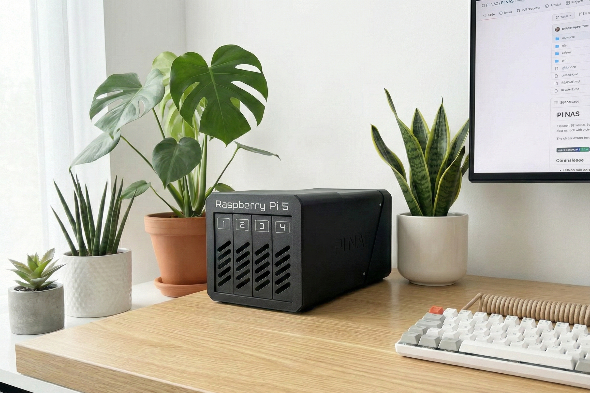
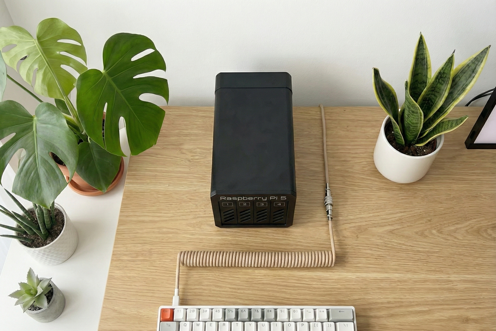
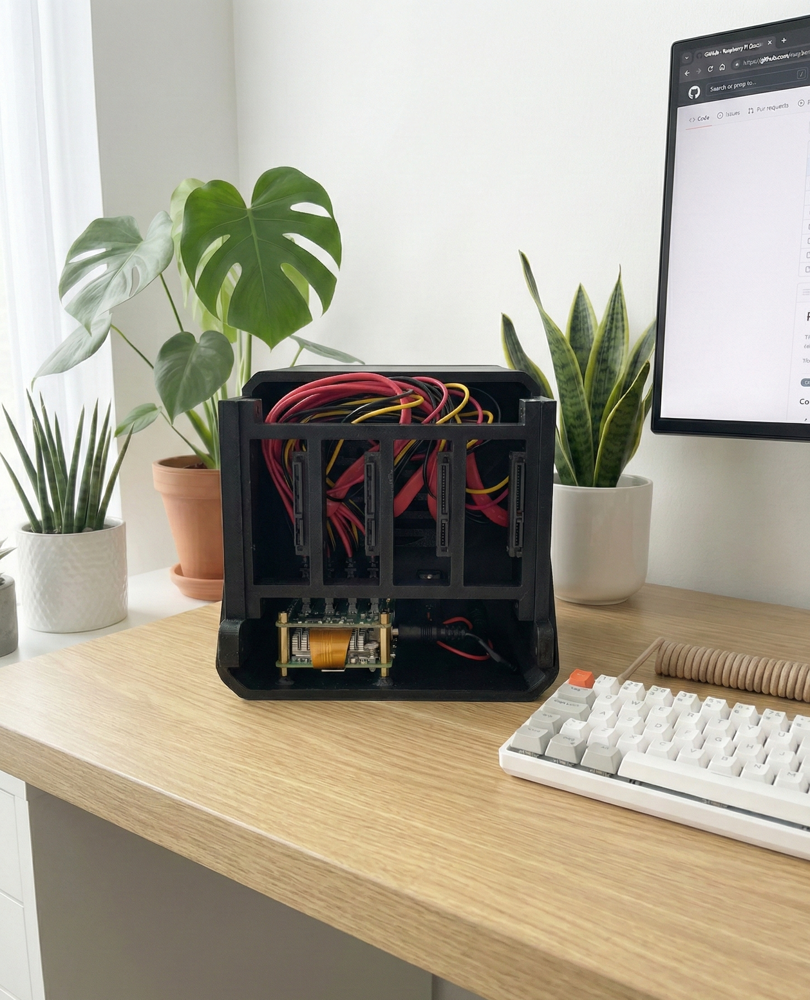

# 📂 Pi5-NAS-4Bay

   

A custom-built, 4-Bay Network Attached Storage (NAS) solution powered by the Raspberry Pi 5. This project leverages the PCIe interface of the Pi 5 to provide high-speed SATA connectivity for a compact, power-efficient home server.

> **Credits:** This build is heavily inspired by [The DIY Life's video](https://www.youtube.com/watch?v=8CmYghBYT0o).

---

## 📖 Table of Contents
- [Architecture & Design](#-architecture--design)
- [Bill of Materials (Hardware)](#-bill-of-materials-hardware)
- [3D Printed Enclosure](#-3d-printed-enclosure)
- [Software Configuration](#-software-configuration)
- [Performance Benchmarks](#-performance-benchmarks)
- [Gallery](#-gallery)

---

## 🏗 Architecture & Design

This NAS avoids USB bottlenecks by using the **Radxa Penta SATA HAT**, which interfaces directly with the Raspberry Pi 5's PCIe lane.

* **Core:** Raspberry Pi 5 (4GB)
* **Storage Interface:** PCIe to 4x SATA (via Radxa HAT)
* **Drive Topology:** 4x 3TB 3.5" HDDs in RAID 5
* **Cooling:** Negative pressure airflow (Front Intake -> Rear Exhaust)
* **Network:** 1GbE using RPI's port

---

## 🛒 Bill of Materials (Hardware)

| Component | Specification | Notes |
| :--- | :--- | :--- |
| **SBC** | Raspberry Pi 5 | 4GB Model |
| **Interface** | [Radxa Penta SATA HAT](https://radxa.com/) | Utilizes PCIe ribbon cable |
| **Storage** | 4x WD Red 4TB | NAS-rated drives |
| **Cooling** | Noctua NF-A8 (80mm) | PWM controlled via the HAT |
| **Power** | 12V 5A+ Power Supply | Powers both the Pi and Drives via the HAT |
| **Misc** | SATA Data Cables | Short generic cables (20cm) |
| **Misc** | SATA Power Splitter | Included with HAT / Custom crimped |

---

## 🖨 3D Printed Enclosure

The case was modeled in Fusion 360 to allow for vertical drive mounting with a separate compartment for the logic board to isolate heat.

* **Material:** PETG (Recommended for heat resistance) or PLA+
* **Infill:** 20% Gyroid
* **Files:** `https://makerworld.com/pl/models/1605027-raspberry-pi-5-based-4-bay-nas#profileId-1692368`

> **Build Note:** The drive trays are modular. Ensure the SATA cables are routed *before* fully sliding the trays into the locked position.

---

## ⚙ Software Configuration

### Operating System
* **Base OS:** Raspberry Pi OS Lite (64-bit)

### OpenMediaVault (OMV) Setup
The system runs OMV 7.7 (Sandworm) as the management interface.

1.  **Installation Script:**
    ```bash
    wget -O - [https://github.com/OpenMediaVault-Plugin-Developers/installScript/raw/master/install](https://github.com/OpenMediaVault-Plugin-Developers/installScript/raw/master/install) | sudo bash
    ```
2.  **RAID Configuration:**
    * **Level:** RAID 5 (Striping with Parity)
    * **File System:** EXT4 (Selected for stability over ZFS on this hardware)
3.  **Services:**
    * **SMB/CIFS:** Main file sharing for Windows/Mac clients.
    * **NFS:** For media server, Longhorn and Proxmox Backups.

---

## 📊 Performance Benchmarks

Testing performed using `CrystalDiskMark` over the network and `dd` locally.

| Connection Type | Read Speed | Write Speed | Bottleneck |
| :--- | :--- | :--- | :--- |
| **Native 1GbE** | ~110 MB/s | ~105 MB/s | Network Interface |

**Power Consumption:**
* **Idle:** ~12W
* **Load (Scrubbing):** ~38W

---

## 📷 Gallery



---


---
