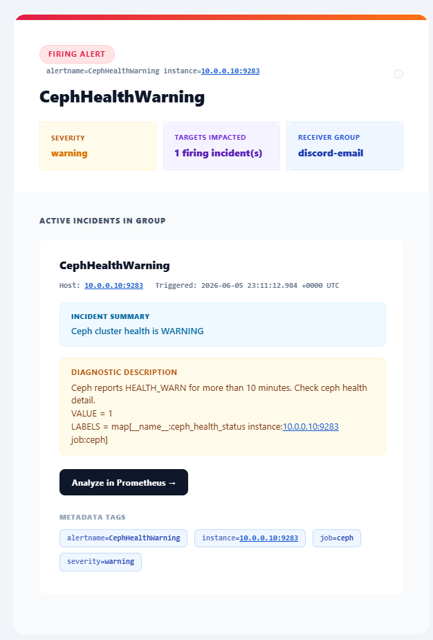

# 📈 Prometheus Stack

The Prometheus stack is used for Kubernetes/K3s metrics, dashboards, logs, and alerting.

## Current Role

This stack covers:

- K3s node and pod metrics
- Kubernetes API server, kubelet, cAdvisor, and kube-state-metrics data
- annotated pod scraping
- Prometheus self-monitoring
- Alertmanager health and notification flow
- Proxmox exporter targets
- Ceph metrics
- Grafana dashboards
- Loki-backed log exploration

## Runtime

The stack runs in the K3s cluster.

Current source locations:

- Prometheus Helm values: [kubernetes/applications/ceph-storage/helm/prometheus/values.yml](../../kubernetes/applications/ceph-storage/helm/prometheus/values.yml)
- Prometheus rule files: [kubernetes/applications/ceph-storage/helm/prometheus/prometheus-rules](../../kubernetes/applications/ceph-storage/helm/prometheus/prometheus-rules)
- Grafana manifests: [kubernetes/applications/ceph-storage/manifests/grafana](../../kubernetes/applications/ceph-storage/manifests/grafana)
- Loki manifests: [kubernetes/applications/ceph-storage/manifests/loki](../../kubernetes/applications/ceph-storage/manifests/loki)

## Prometheus

Prometheus is deployed through Helm with:

- StatefulSet mode enabled
- persistent storage
- 15 day retention
- retention size limit
- lifecycle reload support
- Traefik ingress
- Authentik middleware on the ingress
- Alertmanager enabled
- pushgateway disabled
- chart-managed node exporter disabled

Node exporter is still part of the intended metrics model, but the Prometheus chart values currently disable the bundled `prometheus-node-exporter` subchart. That means node exporter should be deployed separately or enabled intentionally when the cluster monitoring layout changes.

Scrape configuration includes:

- Kubernetes API servers
- Kubernetes nodes
- cAdvisor
- kube-state-metrics
- annotation-based pod scraping
- Pi-hole exporter
- Proxmox PVE exporter targets
- Ceph metrics
- Prometheus and Alertmanager self-monitoring

## Alertmanager

Alertmanager is enabled from the Prometheus Helm values and uses persistent storage.

The public documentation does not include notification webhooks. Real receivers should stay in private configuration or external secret management.

Custom HTML Alertmanager email templates are documented in:

[custom-html-alertmanager-email-alerts.md](custom-html-alertmanager-email-alerts.md)

Preview of the styled Alertmanager notification:

## Grafana

Grafana runs as a Kubernetes Deployment with:

- persistent storage
- Traefik ingress
- readiness and liveness probes
- non-root runtime user
- Authentik/OIDC integration
- local login still enabled

Do not copy Grafana OAuth client secrets into public documentation. The live manifest should use Kubernetes Secrets or another private secret flow for sensitive values.

## Loki

Loki runs as a single-replica StatefulSet with:

- filesystem storage
- persistent volume claim
- retention enabled
- TSDB schema
- ClusterIP service on port `3100`
- Traefik ingress
- ruler integration pointed at Alertmanager

## Alert Coverage

The Prometheus rules cover Kubernetes and Prometheus self-monitoring, including:

- nodes not ready
- scheduling disabled
- memory/disk/network pressure
- pod capacity
- OOMKilled containers
- failed or stuck jobs
- suspended cronjobs
- PVC and persistent volume issues
- volume capacity forecasting
- StatefulSet/Deployment/DaemonSet health
- Kubernetes API errors
- certificate expiry
- missing targets and failed scrapes
- Prometheus reload, rule, TSDB, and Alertmanager failures

## Redaction

Use example domains, example service names, and placeholder webhook values in public docs. Real ingress hostnames, OAuth secrets, webhook URLs, and target IPs should remain private.
