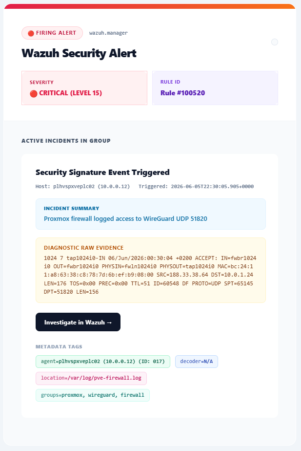

# Custom HTML Email Alerts in Wazuh

This guide explains how to send styled HTML email notifications from Wazuh by routing JSON alerts through a custom integration script.

All paths, domains, email addresses, hostnames, and IP addresses below are examples. Replace them with values from your own environment.

## Goal

Create polished HTML email alerts for Wazuh security events, including:

- Alert status
- Rule level and rule ID
- Agent metadata
- Incident summary
- Raw log evidence
- Metadata tags
- An `Investigate in Wazuh` button

The final flow is:

```text
Wazuh alert -> Integrator daemon -> Custom Python script -> SMTP relay -> HTML email
```

## Preview

The final email should look similar to this preview:



## 1. Architecture

Wazuh's built-in email notification format is plain and limited. To use a richer HTML layout, disable the legacy Wazuh email loop and send JSON alerts to a custom integration script.

This example assumes:

- Wazuh is running in Docker.
- The `wazuh.manager` container has access to `/var/ossec/integrations`.
- A local SMTP relay is reachable from the Wazuh manager container.
- The SMTP relay accepts messages from the configured sender.

One common pattern is a Postfix relay container running on the Docker host with `network_mode: host` and listening on port `25`.

## 2. Create The Integration Script

Create this script in the host path that is mounted into the Wazuh manager integrations directory.

Example host path:

```text
/srv/wazuh/wazuh_integrations/custom-email-alerts.py
```

Container path:

```text
/var/ossec/integrations/custom-email-alerts.py
```

Script:

```python
#!/var/ossec/framework/python/bin/python3
import html
import json
import smtplib
import sys
from email.mime.multipart import MIMEMultipart
from email.mime.text import MIMEText

DEFAULT_RECIPIENT = "recipient@example.com"
SENDER = "alerts@example.com"
WAZUH_DASHBOARD_URL = "https://wazuh.example.com"
SMTP_PORT = 25


def get_host_gateway_ip():
    try:
        with open("/proc/net/route") as route_file:
            for line in route_file:
                parts = line.split()
                if len(parts) > 2 and parts[1] == "00000000":
                    return ".".join(str(int(parts[2][i:i + 2], 16)) for i in (6, 4, 2, 0))
    except Exception:
        pass

    return "host.docker.internal"


def safe(value):
    return html.escape(str(value), quote=True)


def pick_recipient(argv):
    if len(argv) >= 4 and "@" in argv[3]:
        return argv[3]

    if len(argv) >= 3 and "@" in argv[2]:
        return argv[2]

    return DEFAULT_RECIPIENT


if len(sys.argv) < 2:
    sys.exit(0)

alert_file = sys.argv[1]
recipient = pick_recipient(sys.argv)

try:
    with open(alert_file, "r", encoding="utf-8") as file_handle:
        alert = json.load(file_handle)
except Exception:
    sys.exit(0)

rule_block = alert.get("rule", {})
agent_block = alert.get("agent", {})

rule_id = rule_block.get("id", "N/A")

try:
    level = int(rule_block.get("level", 0))
except Exception:
    level = 0

description = rule_block.get("description", "No description provided.")
agent_name = agent_block.get("name", "Wazuh Server")
agent_id = agent_block.get("id", "000")
agent_ip = agent_block.get("ip", "Local")
timestamp = alert.get("timestamp", "N/A")
location = alert.get("location", "N/A")
decoder = alert.get("decoder", {}).get("name", "N/A")
full_log = alert.get("full_log", alert.get("message", "No log payload."))
manager_name = alert.get("manager", {}).get("name", "wazuh-manager")

raw_groups = rule_block.get("groups", [])
groups = ", ".join(raw_groups) if isinstance(raw_groups, list) else str(raw_groups)

if level >= 12:
    status_badge = "Firing Alert"
    severity_text = "critical"
    accent_gradient = "linear-gradient(135deg, #e11d48 0%, #f97316 100%)"
    card_bg = "#fff1f2"
    card_border = "#fecdd3"
    card_text = "#be123c"
    indicator_color = "#e11d48"
elif level >= 7:
    status_badge = "Warning Alert"
    severity_text = "warning"
    accent_gradient = "linear-gradient(135deg, #d97706 0%, #fbbf24 100%)"
    card_bg = "#fef3c7"
    card_border = "#fde68a"
    card_text = "#b45309"
    indicator_color = "#d97706"
else:
    status_badge = "Info Alert"
    severity_text = "info"
    accent_gradient = "linear-gradient(135deg, #16a34a 0%, #4ade80 100%)"
    card_bg = "#f0fdf4"
    card_border = "#dcfce7"
    card_text = "#15803d"
    indicator_color = "#16a34a"

html_rendered = f"""<!DOCTYPE html>
<html>
<head>
  <meta charset="utf-8">
  <meta name="viewport" content="width=device-width, initial-scale=1.0">
</head>
<body style="margin:0;padding:0;background-color:#f1f5f9;color:#334155;font-family:-apple-system,BlinkMacSystemFont,'Segoe UI',Roboto,Helvetica,Arial,sans-serif;">
  <table role="presentation" width="100%" cellspacing="0" cellpadding="0" style="background-color:#f1f5f9;padding:40px 0;">
    <tr>
      <td align="center">
        <table role="presentation" width="600" cellspacing="0" cellpadding="0" style="width:600px;max-width:calc(100% - 32px);background-color:#ffffff;border:1px solid #e2e8f0;border-radius:16px;box-shadow:0 20px 25px -5px rgba(0,0,0,0.03),0 10px 10px -5px rgba(0,0,0,0.03);overflow:hidden;border-collapse:collapse;">
          <tr>
            <td style="height:8px;background:{accent_gradient};"></td>
          </tr>
          <tr>
            <td style="padding:36px 36px 24px 36px;text-align:left;">
              <div style="margin-bottom:12px;text-align:left;">
                <span style="display:inline-block;font-size:11px;font-weight:700;text-transform:uppercase;letter-spacing:0.08em;padding:4px 12px;border-radius:20px;background-color:{card_bg};color:{card_text};border:1px solid {card_border};">{safe(status_badge)}</span>
                <span style="display:inline-block;font-size:11px;font-weight:600;color:#64748b;margin-left:10px;font-family:Consolas,Monaco,monospace;vertical-align:middle;">{safe(manager_name)}</span>
              </div>
              <h1 style="font-size:24px;font-weight:800;color:#0f172a;margin:0;letter-spacing:0;line-height:1.2;text-align:left;">Wazuh Security Alert</h1>
            </td>
          </tr>
          <tr>
            <td style="padding:0 36px 32px 36px;">
              <table role="presentation" cellspacing="0" cellpadding="0" style="width:100%;border-collapse:collapse;">
                <tr>
                  <td style="width:49%;padding:14px 16px;background-color:{card_bg};border:1px solid {card_border};border-radius:10px;text-align:left;">
                    <div style="font-size:10px;font-weight:700;text-transform:uppercase;color:{card_text};letter-spacing:0.05em;margin-bottom:4px;">Severity</div>
                    <div style="font-size:13px;font-weight:800;color:{indicator_color};text-transform:uppercase;">{safe(severity_text)} (Level {safe(level)})</div>
                  </td>
                  <td style="width:2%;"></td>
                  <td style="width:49%;padding:14px 16px;background-color:#f5f3ff;border:1px solid #ede9fe;border-radius:10px;text-align:left;">
                    <div style="font-size:10px;font-weight:700;text-transform:uppercase;color:#6d28d9;letter-spacing:0.05em;margin-bottom:4px;">Rule ID</div>
                    <div style="font-size:14px;font-weight:800;color:#5b21b6;">Rule #{safe(rule_id)}</div>
                  </td>
                </tr>
              </table>
            </td>
          </tr>
          <tr>
            <td style="padding:32px 36px;background-color:#f8fafc;border-top:1px solid #f1f5f9;">
              <div style="font-size:11px;font-weight:800;text-transform:uppercase;color:#475569;letter-spacing:0.08em;margin-bottom:18px;text-align:left;">Active Incidents In Group</div>
              <table role="presentation" cellspacing="0" cellpadding="0" style="width:100%;background-color:#ffffff;border:1px solid #e2e8f0;border-left:5px solid {indicator_color};border-radius:10px;margin-bottom:24px;box-shadow:0 4px 6px -1px rgba(0,0,0,0.01),0 2px 4px -1px rgba(0,0,0,0.01);overflow:hidden;border-collapse:collapse;">
                <tr>
                  <td style="padding:24px;text-align:left;">
                    <div style="font-size:16px;font-weight:800;color:#0f172a;text-align:left;">Security Signature Event Triggered</div>
                    <div style="margin-top:6px;text-align:left;">
                      <span style="display:inline-block;font-size:11px;font-weight:600;font-family:Consolas,Monaco,monospace;color:#64748b;">Host: {safe(agent_name)} ({safe(agent_ip)})</span>
                      <span style="display:inline-block;font-size:11px;font-weight:600;font-family:Consolas,Monaco,monospace;color:#64748b;margin-left:14px;">Triggered: {safe(timestamp)}</span>
                    </div>
                    <div style="background-color:#f0f9ff;border-radius:8px;padding:12px 16px;margin:16px 0;text-align:left;border:1px solid #e0f2fe;">
                      <div style="font-size:10px;font-weight:800;text-transform:uppercase;color:#0369a1;letter-spacing:0.05em;margin-bottom:4px;">Incident Summary</div>
                      <div style="font-size:13px;color:#0369a1;line-height:1.45;font-weight:500;">{safe(description)}</div>
                    </div>
                    <div style="background-color:#fffbeb;border-radius:8px;padding:12px 16px;margin:16px 0;text-align:left;border:1px solid #fef3c7;">
                      <div style="font-size:11px;font-weight:700;text-transform:uppercase;color:#b45309;letter-spacing:0.05em;margin-bottom:4px;">Diagnostic Raw Evidence</div>
                      <div style="font-size:12px;color:#78350f;line-height:1.45;white-space:pre-wrap;font-family:Consolas,Monaco,monospace;word-break:break-all;">{safe(full_log)}</div>
                    </div>
                    <div style="margin:20px 0 16px 0;text-align:left;">
                      <a href="{safe(WAZUH_DASHBOARD_URL)}" style="display:inline-block;background-color:#0f172a;color:#ffffff;text-decoration:none;padding:10px 18px;border-radius:8px;font-weight:700;font-size:12px;letter-spacing:0.025em;box-shadow:0 4px 6px -1px rgba(15,23,42,0.15);">Investigate in Wazuh -&gt;</a>
                    </div>
                    <div style="font-weight:800;font-size:10px;text-transform:uppercase;color:#94a3b8;letter-spacing:0.06em;margin:24px 0 10px 0;text-align:left;">Metadata Tags</div>
                    <div style="text-align:left;">
                      <span style="display:inline-block;background-color:#ecfdf5;border:1px solid #a7f3d0;color:#065f46;font-family:Consolas,Monaco,monospace;font-size:11px;padding:4px 10px;margin-right:6px;margin-bottom:8px;border-radius:6px;font-weight:600;"><strong style="opacity:0.75;">agent</strong>={safe(agent_name)} (ID: {safe(agent_id)})</span>
                      <span style="display:inline-block;background-color:#eff6ff;border:1px solid #bfdbfe;color:#1e40af;font-family:Consolas,Monaco,monospace;font-size:11px;padding:4px 10px;margin-right:6px;margin-bottom:8px;border-radius:6px;font-weight:600;"><strong style="opacity:0.75;">decoder</strong>={safe(decoder)}</span>
                      <span style="display:inline-block;background-color:#fdf2f8;border:1px solid #fbcfe8;color:#be185d;font-family:Consolas,Monaco,monospace;font-size:11px;padding:4px 10px;margin-right:6px;margin-bottom:8px;border-radius:6px;font-weight:600;"><strong style="opacity:0.75;">location</strong>={safe(location)}</span>
                      <span style="display:inline-block;background-color:#f0fdfa;border:1px solid #ccfbf1;color:#0f766e;font-family:Consolas,Monaco,monospace;font-size:11px;padding:4px 10px;margin-right:6px;margin-bottom:8px;border-radius:6px;font-weight:600;"><strong style="opacity:0.75;">groups</strong>={safe(groups)}</span>
                    </div>
                  </td>
                </tr>
              </table>
            </td>
          </tr>
        </table>
      </td>
    </tr>
  </table>
</body>
</html>"""

message = MIMEMultipart("alternative")
message["Subject"] = f"[Level {level}] Wazuh Security Alert - Rule {rule_id}"
message["From"] = SENDER
message["To"] = recipient
message.attach(MIMEText(html_rendered, "html"))

try:
    with smtplib.SMTP(get_host_gateway_ip(), SMTP_PORT) as server:
        server.sendmail(SENDER, [recipient], message.as_string())
except Exception as error:
    print(f"Error sending custom Wazuh HTML email: {error}", file=sys.stderr)
```

## 3. Fix Line Endings And Permissions

Wazuh runs integrations through a restrictive wrapper. Wrong ownership, permissions, or Windows line endings can prevent execution.

Run these commands against the manager container:

```bash
docker exec -it wazuh.manager sed -i 's/\r$//' /var/ossec/integrations/custom-email-alerts.py
docker exec -it wazuh.manager chown root:wazuh /var/ossec/integrations/custom-email-alerts.py
docker exec -it wazuh.manager chmod 750 /var/ossec/integrations/custom-email-alerts.py
```

## 4. Disable Legacy Email And Enable The Integration

Edit the Wazuh manager configuration file.

Example host path:

```text
/srv/wazuh/config/wazuh_cluster/wazuh_manager.conf
```

Add or update:

```xml
<ossec_config>
  <global>
    <email_notification>no</email_notification>
  </global>

  <integration>
    <name>custom-email-alerts.py</name>
    <hook_url>recipient@example.com</hook_url>
    <level>12</level>
    <alert_format>json</alert_format>
  </integration>
</ossec_config>
```

Notes:

- `<email_notification>no</email_notification>` disables the built-in plain text email loop.
- `<name>` must match the integration script name.
- `<hook_url>` is used here as the destination email address passed to the script.
- `<level>` controls the minimum Wazuh rule level that triggers the integration.
- `<alert_format>json</alert_format>` is required because the script parses JSON.

## 5. Recreate The Manager Container

If the script or manager configuration is mounted into Docker, recreate the manager container so bind-mounted file changes are loaded cleanly.

Example:

```bash
docker compose down wazuh.manager
docker compose up -d wazuh.manager
```

Use the service name from your own compose file.

## 6. Verify The Integration

Watch the Wazuh manager logs:

```bash
docker exec -it wazuh.manager sh -c 'tail -f /var/ossec/logs/ossec.log | grep -E -i "integratord|custom-email-alerts"'
```

Expected signs:

- Integrator starts without permission errors.
- The custom script is launched for matching alerts.
- No SMTP connection or relay rejection errors appear.
- HTML email arrives in the recipient inbox.

## 7. Troubleshooting

If the script does not run:

- Confirm the script exists at `/var/ossec/integrations/custom-email-alerts.py`.
- Confirm ownership is `root:wazuh`.
- Confirm permissions are `750`.
- Confirm the file uses Unix line endings.
- Confirm `<name>` matches the script filename.
- Confirm the alert level is equal to or greater than the configured `<level>`.

If email is not sent:

- Confirm the SMTP relay is reachable from the Wazuh manager container.
- Confirm the relay allows the configured sender.
- Confirm the recipient address is valid.
- Check `/var/ossec/logs/ossec.log` for integration errors.
- Check the SMTP relay logs for rejected messages.

If HTML renders incorrectly:

- Confirm the message is sent as `MIMEText(html_rendered, "html")`.
- Keep CSS inline, because most email clients strip external stylesheets.
- Avoid unsupported CSS features where possible.

## 8. Redaction And Safety

Do not commit:

- Real SMTP passwords
- App passwords
- Private relay credentials
- Internal domains
- Personal email addresses
- Real hostnames
- Private IP addresses
- Agent keys
- Generated certificates or private keys

Use placeholders such as:

```text
alerts@example.com
recipient@example.com
wazuh.example.com
endpoint-01
192.0.2.25
```
