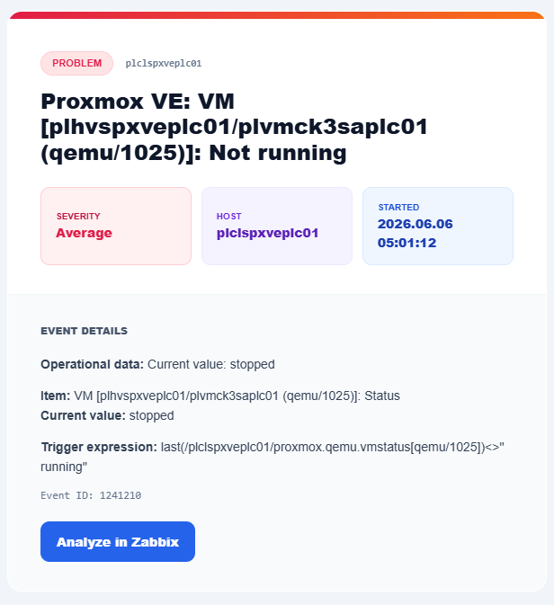

# Custom HTML Email Alerts in Zabbix

This guide explains how to configure Prometheus-style HTML email alerts in Zabbix using a dedicated email media type, custom message templates, and a button linking back to the Zabbix event details page.

All domains, email addresses, and hostnames below are examples. Replace them with values from your environment.

## Goal

Create polished HTML email alerts for:

- Problem events
- Problem recovery events
- Problem update events

The final flow is:

```text
Trigger fires -> Zabbix action -> User media -> Custom HTML email media type -> Email inbox
```

## Preview

The final problem email should look similar to this redacted preview:



## 1. Create A Dedicated HTML Email Media Type

In the Zabbix web UI, go to:

```text
Alerts -> Media types
```

Click:

```text
Create media type
```

Configure the media type:

```text
Name: Custom Email (HTML)
Type: Email
Email provider: Gmail
Email: alerts@example.com
Password: app password or SMTP password
Message format: HTML
Enabled: checked
```

Recommended approach:

- Keep the default email media type as a fallback.
- Use this new `Custom Email (HTML)` media type only for styled alerts.
- If using Gmail, use a Google app password rather than the regular account password.

## 2. Configure Message Templates

Open the media type and go to:

```text
Message templates
```

Edit these templates:

```text
Problem
Problem recovery
Problem update
```

Leave discovery and autoregistration templates as defaults unless you also want to style them.

## 3. Problem Template

Subject:

```text
Problem: {EVENT.NAME}
```

Message:

```html
<body style="margin:0;padding:0;background:#f1f5f9;color:#334155;font-family:Arial,Helvetica,sans-serif;">
<table width="100%" cellspacing="0" cellpadding="0" style="background:#f1f5f9;padding:40px 0;">
<tr><td align="center">
<table width="600" cellspacing="0" cellpadding="0" style="width:600px;max-width:calc(100% - 32px);background:#ffffff;border:1px solid #e2e8f0;border-radius:16px;overflow:hidden;border-collapse:collapse;">
<tr><td style="height:8px;background:linear-gradient(135deg,#e11d48 0%,#f97316 100%);"></td></tr>

<tr><td style="padding:36px 36px 24px;">
<span style="display:inline-block;font-size:11px;font-weight:700;text-transform:uppercase;padding:4px 12px;border-radius:20px;background:#ffe4e6;color:#e11d48;border:1px solid #fecdd3;">Problem</span>
<span style="font-size:11px;font-weight:600;color:#64748b;margin-left:10px;font-family:Consolas,monospace;">{{HOST.NAME}.htmlencode()}</span>
<h1 style="font-size:24px;font-weight:800;color:#0f172a;margin:14px 0 0;line-height:1.2;">{{EVENT.NAME}.htmlencode()}</h1>
</td></tr>

<tr><td style="padding:0 36px 32px;">
<table width="100%" cellspacing="0" cellpadding="0"><tr>
<td style="width:32%;padding:14px 16px;background:#fff1f2;border:1px solid #fecdd3;border-radius:10px;">
<div style="font-size:10px;font-weight:700;text-transform:uppercase;color:#be123c;">Severity</div>
<div style="font-size:14px;font-weight:800;color:#e11d48;">{{EVENT.SEVERITY}.htmlencode()}</div>
</td>
<td style="width:2%;"></td>
<td style="width:32%;padding:14px 16px;background:#f5f3ff;border:1px solid #ede9fe;border-radius:10px;">
<div style="font-size:10px;font-weight:700;text-transform:uppercase;color:#6d28d9;">Host</div>
<div style="font-size:14px;font-weight:800;color:#5b21b6;">{{HOST.NAME}.htmlencode()}</div>
</td>
<td style="width:2%;"></td>
<td style="width:32%;padding:14px 16px;background:#eff6ff;border:1px solid #dbeafe;border-radius:10px;">
<div style="font-size:10px;font-weight:700;text-transform:uppercase;color:#1d4ed8;">Started</div>
<div style="font-size:14px;font-weight:800;color:#1e40af;">{{EVENT.DATE}.htmlencode()} {{EVENT.TIME}.htmlencode()}</div>
</td>
</tr></table>
</td></tr>

<tr><td style="padding:32px 36px;background:#f8fafc;border-top:1px solid #f1f5f9;">
<div style="font-size:11px;font-weight:800;text-transform:uppercase;color:#475569;margin-bottom:18px;">Event Details</div>
<p style="margin:0 0 12px;font-size:14px;line-height:1.6;"><b>Operational data:</b> {{EVENT.OPDATA}.htmlencode()}</p>
<p style="margin:0 0 12px;font-size:14px;line-height:1.6;"><b>Item:</b> {{ITEM.NAME1}.htmlencode()}<br><b>Current value:</b> {{ITEM.VALUE1}.htmlencode()}</p>
<p style="margin:0 0 12px;font-size:14px;line-height:1.6;"><b>Trigger expression:</b> {{TRIGGER.EXPRESSION}.htmlencode()}</p>
<p style="margin:0 0 20px;font-size:12px;color:#64748b;font-family:Consolas,Monaco,monospace;">Event ID: {{EVENT.ID}.htmlencode()}</p>
<table cellspacing="0" cellpadding="0"><tr><td style="border-radius:10px;background:#2563eb;">
<a href="https://zabbix.example.com/zabbix/tr_events.php?triggerid={TRIGGER.ID}&eventid={EVENT.ID}" style="display:inline-block;padding:12px 18px;font-size:14px;font-weight:800;color:#ffffff;text-decoration:none;border-radius:10px;">Analyze in Zabbix</a>
</td></tr></table>
</td></tr>
</table>
</td></tr>
</table>
</body>
```

## 4. Problem Recovery Template

Subject:

```text
Resolved in {EVENT.DURATION}: {EVENT.NAME}
```

Message:

```html
<body style="margin:0;padding:0;background:#f1f5f9;color:#334155;font-family:Arial,Helvetica,sans-serif;">
<table width="100%" cellspacing="0" cellpadding="0" style="background:#f1f5f9;padding:40px 0;">
<tr><td align="center">
<table width="600" cellspacing="0" cellpadding="0" style="width:600px;max-width:calc(100% - 32px);background:#ffffff;border:1px solid #e2e8f0;border-radius:16px;overflow:hidden;border-collapse:collapse;">
<tr><td style="height:8px;background:linear-gradient(135deg,#16a34a 0%,#0ea5e9 100%);"></td></tr>

<tr><td style="padding:36px 36px 24px;">
<span style="display:inline-block;font-size:11px;font-weight:700;text-transform:uppercase;padding:4px 12px;border-radius:20px;background:#dcfce7;color:#16a34a;border:1px solid #bbf7d0;">Resolved</span>
<span style="font-size:11px;font-weight:600;color:#64748b;margin-left:10px;font-family:Consolas,monospace;">{{HOST.NAME}.htmlencode()}</span>
<h1 style="font-size:24px;font-weight:800;color:#0f172a;margin:14px 0 0;line-height:1.2;">{{EVENT.NAME}.htmlencode()}</h1>
</td></tr>

<tr><td style="padding:0 36px 32px;">
<table width="100%" cellspacing="0" cellpadding="0"><tr>
<td style="width:32%;padding:14px 16px;background:#dcfce7;border:1px solid #bbf7d0;border-radius:10px;">
<div style="font-size:10px;font-weight:700;text-transform:uppercase;color:#15803d;">Status</div>
<div style="font-size:14px;font-weight:800;color:#16a34a;">Resolved</div>
</td>
<td style="width:2%;"></td>
<td style="width:32%;padding:14px 16px;background:#f5f3ff;border:1px solid #ede9fe;border-radius:10px;">
<div style="font-size:10px;font-weight:700;text-transform:uppercase;color:#6d28d9;">Host</div>
<div style="font-size:14px;font-weight:800;color:#5b21b6;">{{HOST.NAME}.htmlencode()}</div>
</td>
<td style="width:2%;"></td>
<td style="width:32%;padding:14px 16px;background:#eff6ff;border:1px solid #dbeafe;border-radius:10px;">
<div style="font-size:10px;font-weight:700;text-transform:uppercase;color:#1d4ed8;">Duration</div>
<div style="font-size:14px;font-weight:800;color:#1e40af;">{{EVENT.DURATION}.htmlencode()}</div>
</td>
</tr></table>
</td></tr>

<tr><td style="padding:32px 36px;background:#f8fafc;border-top:1px solid #f1f5f9;">
<div style="font-size:11px;font-weight:800;text-transform:uppercase;color:#475569;margin-bottom:18px;">Resolution Details</div>
<p style="margin:0 0 12px;font-size:14px;line-height:1.6;"><b>Resolved at:</b> {{EVENT.RECOVERY.TIME}.htmlencode()} on {{EVENT.RECOVERY.DATE}.htmlencode()}</p>
<p style="margin:0 0 12px;font-size:14px;line-height:1.6;"><b>Problem duration:</b> {{EVENT.DURATION}.htmlencode()}</p>
<p style="margin:0 0 12px;font-size:14px;line-height:1.6;"><b>Severity:</b> {{EVENT.SEVERITY}.htmlencode()}</p>
<p style="margin:0 0 12px;font-size:14px;line-height:1.6;"><b>Item:</b> {{ITEM.NAME1}.htmlencode()}<br><b>Recovery value:</b> {{ITEM.VALUE1}.htmlencode()}</p>
<p style="margin:0 0 20px;font-size:12px;color:#64748b;font-family:Consolas,Monaco,monospace;">Original event ID: {{EVENT.ID}.htmlencode()}</p>
<table cellspacing="0" cellpadding="0"><tr><td style="border-radius:10px;background:#2563eb;">
<a href="https://zabbix.example.com/zabbix/tr_events.php?triggerid={TRIGGER.ID}&eventid={EVENT.ID}" style="display:inline-block;padding:12px 18px;font-size:14px;font-weight:800;color:#ffffff;text-decoration:none;border-radius:10px;">Analyze in Zabbix</a>
</td></tr></table>
</td></tr>
</table>
</td></tr>
</table>
</body>
```

## 5. Problem Update Template

Subject:

```text
Updated problem in {EVENT.AGE}: {EVENT.NAME}
```

Message:

```html
<body style="margin:0;padding:0;background:#f1f5f9;color:#334155;font-family:Arial,Helvetica,sans-serif;">
<table width="100%" cellspacing="0" cellpadding="0" style="background:#f1f5f9;padding:40px 0;">
<tr><td align="center">
<table width="600" cellspacing="0" cellpadding="0" style="width:600px;max-width:calc(100% - 32px);background:#ffffff;border:1px solid #e2e8f0;border-radius:16px;overflow:hidden;border-collapse:collapse;">
<tr><td style="height:8px;background:linear-gradient(135deg,#2563eb 0%,#7c3aed 100%);"></td></tr>

<tr><td style="padding:36px 36px 24px;">
<span style="display:inline-block;font-size:11px;font-weight:700;text-transform:uppercase;padding:4px 12px;border-radius:20px;background:#dbeafe;color:#2563eb;border:1px solid #bfdbfe;">Update</span>
<span style="font-size:11px;font-weight:600;color:#64748b;margin-left:10px;font-family:Consolas,monospace;">{{HOST.NAME}.htmlencode()}</span>
<h1 style="font-size:24px;font-weight:800;color:#0f172a;margin:14px 0 0;line-height:1.2;">{{EVENT.NAME}.htmlencode()}</h1>
</td></tr>

<tr><td style="padding:0 36px 32px;">
<table width="100%" cellspacing="0" cellpadding="0"><tr>
<td style="width:32%;padding:14px 16px;background:#eff6ff;border:1px solid #dbeafe;border-radius:10px;">
<div style="font-size:10px;font-weight:700;text-transform:uppercase;color:#1d4ed8;">Status</div>
<div style="font-size:14px;font-weight:800;color:#2563eb;">{{EVENT.STATUS}.htmlencode()}</div>
</td>
<td style="width:2%;"></td>
<td style="width:32%;padding:14px 16px;background:#f5f3ff;border:1px solid #ede9fe;border-radius:10px;">
<div style="font-size:10px;font-weight:700;text-transform:uppercase;color:#6d28d9;">Age</div>
<div style="font-size:14px;font-weight:800;color:#5b21b6;">{{EVENT.AGE}.htmlencode()}</div>
</td>
<td style="width:2%;"></td>
<td style="width:32%;padding:14px 16px;background:#fffbeb;border:1px solid #fef3c7;border-radius:10px;">
<div style="font-size:10px;font-weight:700;text-transform:uppercase;color:#b45309;">Acknowledged</div>
<div style="font-size:14px;font-weight:800;color:#d97706;">{{EVENT.ACK.STATUS}.htmlencode()}</div>
</td>
</tr></table>
</td></tr>

<tr><td style="padding:32px 36px;background:#f8fafc;border-top:1px solid #f1f5f9;">
<div style="font-size:11px;font-weight:800;text-transform:uppercase;color:#475569;margin-bottom:18px;">Update Details</div>
<p style="margin:0 0 12px;font-size:14px;line-height:1.6;"><b>{{USER.FULLNAME}.htmlencode()} {{EVENT.UPDATE.ACTION}.htmlencode()} problem</b> at {{EVENT.UPDATE.DATE}.htmlencode()} {{EVENT.UPDATE.TIME}.htmlencode()}.</p>
<p style="margin:0 0 12px;font-size:14px;line-height:1.6;">{{EVENT.UPDATE.MESSAGE}.htmlencode()}</p>
<p style="margin:0 0 12px;font-size:14px;line-height:1.6;"><b>Current problem status:</b> {{EVENT.STATUS}.htmlencode()}</p>
<p style="margin:0 0 20px;font-size:12px;color:#64748b;font-family:Consolas,Monaco,monospace;">Event ID: {{EVENT.ID}.htmlencode()}</p>
<table cellspacing="0" cellpadding="0"><tr><td style="border-radius:10px;background:#2563eb;">
<a href="https://zabbix.example.com/zabbix/tr_events.php?triggerid={TRIGGER.ID}&eventid={EVENT.ID}" style="display:inline-block;padding:12px 18px;font-size:14px;font-weight:800;color:#ffffff;text-decoration:none;border-radius:10px;">Analyze in Zabbix</a>
</td></tr></table>
</td></tr>
</table>
</td></tr>
</table>
</body>
```

## 6. Attach The Media Type To A User

Creating the media type is not enough. Each recipient user must have this media type configured.

Go to:

```text
Users -> Users
```

Open the target user and go to:

```text
Media
```

Add:

```text
Type: Custom Email (HTML)
Send to: recipient@example.com
When active: 1-7,00:00-24:00
Use if severity: select the desired severities
Enabled: checked
```

Save the user.

If alerts fail with this error:

```text
No media defined for user.
```

It means the action selected a user that does not have `Custom Email (HTML)` configured in the user's media list.

## 7. Configure Or Verify Trigger Actions

Go to:

```text
Alerts -> Actions -> Trigger actions
```

Open the action used for trigger notifications.

Verify that the operation sends to:

```text
Send to users: target user
```

or:

```text
Send to user groups: target user group
```

The user or users selected by the action must have the `Custom Email (HTML)` media entry configured.

## 8. Test The Media Type

Go to:

```text
Alerts -> Media types -> Custom Email (HTML)
```

Use the test button if available.

If the test fails with:

```text
Login denied
```

Check:

- The SMTP username is correct.
- The password is an app password if the provider requires one.
- The sender account allows SMTP access.
- The app password was pasted without spaces.
- The account has not blocked the login attempt as suspicious.

## 9. Test A Real Alert

After the media type test passes, trigger a low-risk test alert.

For example, on a Linux host you can create a temporary file to consume disk space:

```bash
dd if=/dev/zero of=./15gb-test-file bs=1G count=15 status=progress
```

Fallback if `bs=1G` is unsupported:

```bash
dd if=/dev/zero of=./15gb-test-file bs=1M count=15360 status=progress
```

Remove the file after testing:

```bash
rm ./15gb-test-file
```

## 10. Notes

- `{{MACRO}.htmlencode()}` is used to safely render Zabbix values inside HTML.
- `{TRIGGER.URL}` is often empty unless a URL is configured directly on the trigger.
- The `Analyze in Zabbix` button uses the event details page instead:

```text
https://zabbix.example.com/zabbix/tr_events.php?triggerid={TRIGGER.ID}&eventid={EVENT.ID}
```

- Replace `https://zabbix.example.com/zabbix` with the real Zabbix frontend URL in your own deployment.
- Do not commit real SMTP passwords, app passwords, personal email addresses, or internal domains to the repository.
